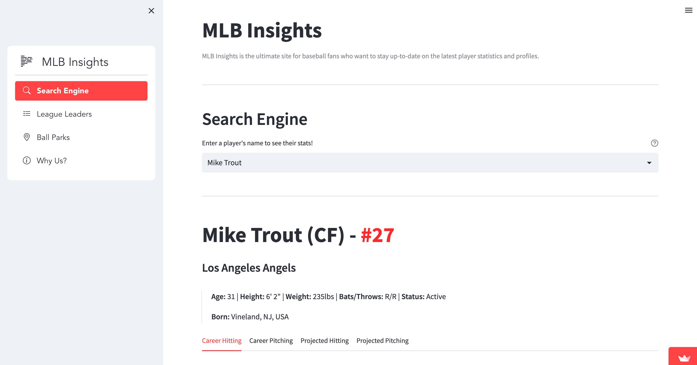
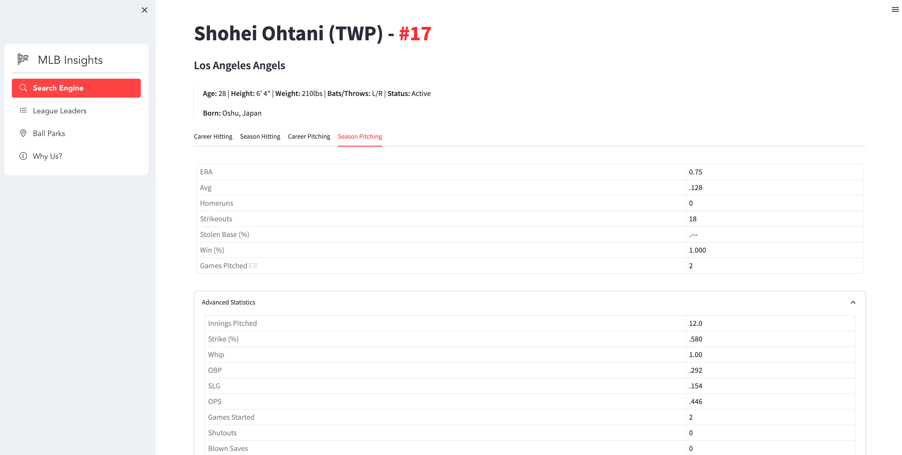
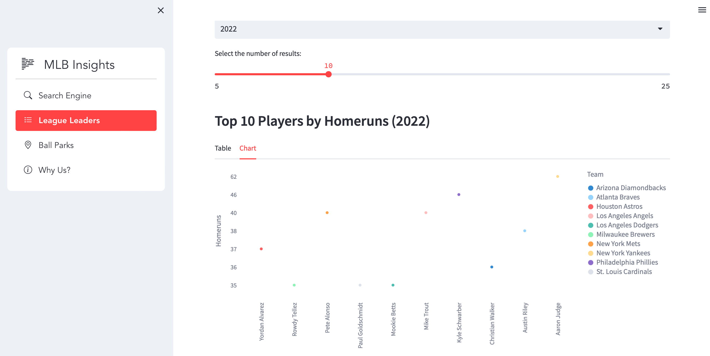
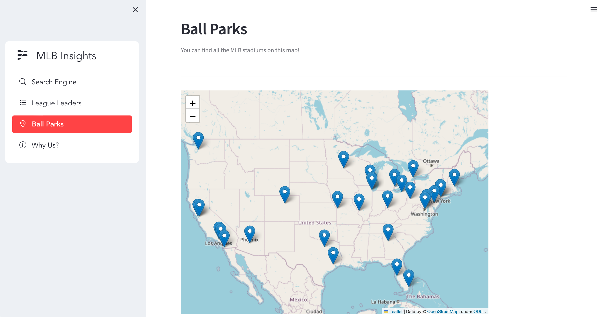
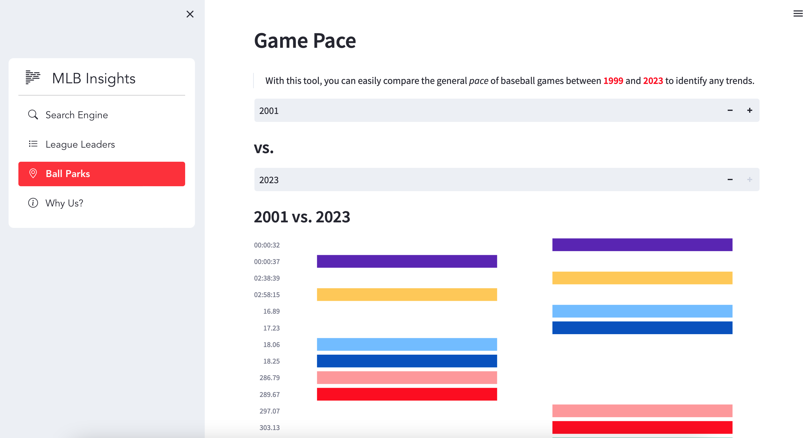
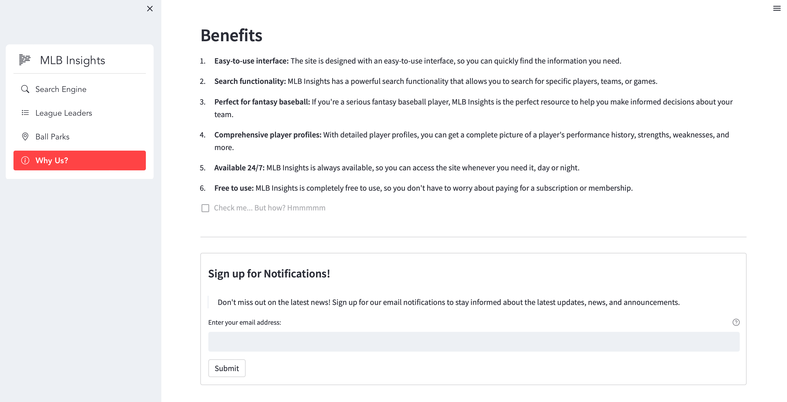

# MLB Insights

> MLB Insights is the ultimate site for baseball fans who want to stay up-to-date on the latest player statistics and profiles.
>
> **UPDATE [12/15/24]:** Looks like the `http://lookup-service-prod.mlb.com` has now been fully deprecated and put out of commision (replaced by `http://statsapi.mlb.com`).
> As a result, the main `Search Engine` tab is unable to pull the relevant data. For now, I do NOT plan to migrate that functionality to the new API :/
>
> **Live App:** [mlb-insights.streamlit.app](https://mlb-insights.streamlit.app/)

## Installation and Usage

1. Install Dependencies: `pip install -r requirements.txt`
2. Run `streamlit run app.py`

## Technologies Used

MLB Insights is built on several technologies, including:

- **Python:** The programming language used to build the site's backend.
- **Streamlit:** The framework used to build and host the site's frontend.
- **MLB Stats API:** The data source used to provide up-to-date player statistics and profiles.

## Preview

### Search Engine

### Player Statistics

### League Leaders

### Ballparks

### Game Pace

### Benefits

## License

Copyright (c) 2023 Sebastian Nunez

Permission is hereby granted, free of charge, to any person obtaining
a copy of this software and associated documentation files (the
"Software"), to deal in the Software without restriction, including
without limitation the rights to use, copy, modify, merge, publish,
distribute, sublicense, and/or sell copies of the Software, and to
permit persons to whom the Software is furnished to do so, subject to
the following conditions:

The above copyright notice and this permission notice shall be
included in all copies or substantial portions of the Software.

THE SOFTWARE IS PROVIDED "AS IS", WITHOUT WARRANTY OF ANY KIND,
EXPRESS OR IMPLIED, INCLUDING BUT NOT LIMITED TO THE WARRANTIES OF
MERCHANTABILITY, FITNESS FOR A PARTICULAR PURPOSE AND
NONINFRINGEMENT. IN NO EVENT SHALL THE AUTHORS OR COPYRIGHT HOLDERS BE
LIABLE FOR ANY CLAIM, DAMAGES OR OTHER LIABILITY, WHETHER IN AN ACTION
OF CONTRACT, TORT OR OTHERWISE, ARISING FROM, OUT OF OR IN CONNECTION
WITH THE SOFTWARE OR THE USE OR OTHER DEALINGS IN THE SOFTWARE.
